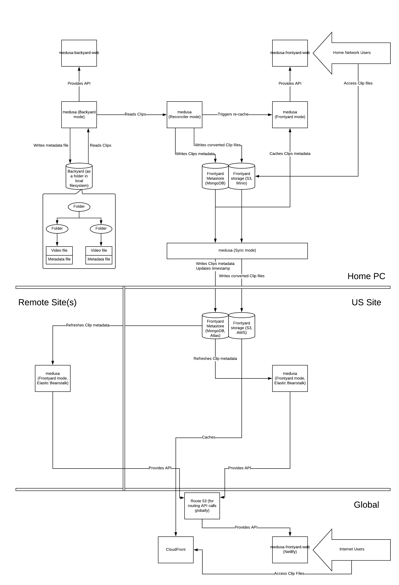

# medusa-docs
Technical documentation for medusa, an avant-garde video and gallery management application

## Functionally
Medusa is an application that
* manages a reservoir of video files in a folder of the local filesystem
    * Each `Video` file is accompanied with a metadata file
    * Each `Video` file, according to its metadata, could be separated into one or more segments. Each segment is called a `Clip`.
    * Every `Clip` should have a fixed set of `Tag`s, and each `Clip` has its own `Tag` values in the metadata file of its `Video` file
    * All `Clip`s of the `Video` files that are under the same folder could have a same `Tag` value if the metadata file of that folder says so
    * The reservoir of video files and their metadata is collectively called the `Backyard`
* converts the `Clip`s into some standard video formats
    * There are globally defined video formats that every `Clip` should be converted to. Those formats are called `Profile`s.
    * The converted `Clip`s are put into a storage location called `Frontyard storage`
    * Metadata of the `Clip`s are also put into a database called `Frontyard metastore`
* serves the converted `Clip`s and their metadata to public
    * `Frontyard storage` and `Frontyard metastore` are collectively called the `Frontyard`
  
## Architecturally
Medusa is a single Python application that can be launched into four modes
* `Backyard` mode is a web server that serves the API that manages the `Backyard`. The API can
    * discover `Video` files
    * read and write metadata file for a `Video` file
    * serve the fixed set of `Tag`s
* `Frontyard` mode is a web server that serves the API for `Frontyard`. It
    * caches and periodically refreshes `Clip`s from `Frontyard metastore` that also include URLs to `Clip`s in `Frontyard storage`
    * serves `Clip`s as an API
* `Reconciler` mode is a CLI tool that
    * converts `Clip`s of `Video` files according to `Profile`s and put the converted files into `Frontyard storage`
    * put metadata of `Clip`s into `Frontyard metastore`
    * triggers a re-cache of `Clip`s for the running `Frontyard` server
* `Sync` mode is a CLI tool that
    * Assuming there is another copy of `Frontyard` (`Frontyard` server, `Frontyard metastore` and `Frontyard storage`) running in the cloud
    * synchronizes `Clip`s of `Video` files according to `Profile`s to the remote `Frontyard storage`
    * put metadata of `Clip`s into the remote `Frontyard metastore`
    * triggers a re-cache of `Clip`s for the running remote `Frontyard` server

